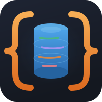

<p align="center">
  
</p>

# CRUDCrate

**REST APIs from your database models. One derive macro. That's it.**

```rust
use crudcrate::EntityToModels;
use sea_orm::entity::prelude::*;

#[derive(Clone, Debug, DeriveEntityModel, EntityToModels)]
#[crudcrate(generate_router)]
#[sea_orm(table_name = "todos")]
pub struct Model {
    #[sea_orm(primary_key)]
    #[crudcrate(primary_key)]
    pub id: i32,

    #[crudcrate(filterable, sortable)]
    pub title: String,

    pub completed: bool,
}
```

**That's it.** You now have:

```bash
GET    /todos           # List with filtering, sorting, pagination
GET    /todos/:id       # Get one
POST   /todos           # Create
PUT    /todos/:id       # Update
DELETE /todos/:id       # Delete
DELETE /todos           # Bulk delete
```

---

## Try It Now

```bash
git clone https://github.com/evanjt/crudcrate
cd crudcrate/crudcrate
cargo run --example minimal
```

Then visit:
- **API**: http://localhost:3000/todo
- **Docs**: http://localhost:3000/docs (interactive OpenAPI)

---

## Install

```bash
cargo add crudcrate
```

Or add to `Cargo.toml`:

```toml
[dependencies]
crudcrate = "0.1"
```

---

## Quick Example

```rust
use axum::Router;
use crudcrate::EntityToModels;
use sea_orm::{entity::prelude::*, Database};

#[derive(Clone, Debug, DeriveEntityModel, EntityToModels)]
#[crudcrate(generate_router)]
#[sea_orm(table_name = "items")]
pub struct Model {
    #[sea_orm(primary_key)]
    #[crudcrate(primary_key)]
    pub id: i32,

    #[crudcrate(filterable, sortable)]
    pub name: String,
}

#[derive(Copy, Clone, Debug, EnumIter, DeriveRelation)]
pub enum Relation {}

impl ActiveModelBehavior for ActiveModel {}

#[tokio::main]
async fn main() {
    let db = Database::connect("sqlite::memory:").await.unwrap();

    let app = Router::new()
        .merge(item_router())
        .layer(axum::Extension(db));

    let listener = tokio::net::TcpListener::bind("0.0.0.0:3000").await.unwrap();
    axum::serve(listener, app).await.unwrap();
}
```

Run it:

```bash
cargo run
```

Test it:

```bash
# Create
curl -X POST http://localhost:3000/items \
  -H "Content-Type: application/json" \
  -d '{"name": "My Item"}'

# List all
curl http://localhost:3000/items

# Filter
curl 'http://localhost:3000/items?filter={"name":"My Item"}'

# Sort
curl 'http://localhost:3000/items?sort=["name","DESC"]'
```

---

## Features

Mark fields to enable capabilities:

```rust
#[crudcrate(filterable)]     // Enable filtering on this field
#[crudcrate(sortable)]       // Enable sorting on this field
#[crudcrate(fulltext)]       // Include in fulltext search
#[crudcrate(exclude(create))] // Don't include in create requests
```

Auto-generate values:

```rust
#[crudcrate(on_create = Uuid::new_v4())]      // Generate ID
#[crudcrate(on_create = chrono::Utc::now())]  // Set timestamp
#[crudcrate(on_update = chrono::Utc::now())]  // Update timestamp
```

Load relationships:

```rust
#[sea_orm(ignore)]
#[crudcrate(non_db_attr, join(one, all))]
pub comments: Vec<Comment>,
```

---

## What Gets Generated

From your entity, CRUDCrate generates:

| Generated | Purpose |
|-----------|---------|
| `Item` | Response model |
| `ItemCreate` | Create request body |
| `ItemUpdate` | Update request body (all fields optional) |
| `ItemList` | List response model |
| `item_router()` | Axum router with all endpoints |
| `CRUDResource` impl | Database operations |

---

## Learn

<div class="grid cards">

**Tutorial**
Start here. Learn CRUDCrate step by step.
[First Steps](./tutorial/first-steps.md)

**Examples**
See complete, working code.
[Minimal Example](./examples/minimal.md)

**Reference**
All attributes and options.
[Field Attributes](./reference/field-attributes.md)

</div>

---

## Requirements

- Rust 1.70+
- Sea-ORM 1.0+
- Axum 0.7+

CRUDCrate works with PostgreSQL, MySQL, and SQLite.

---

## License

MIT License - use it however you want.
